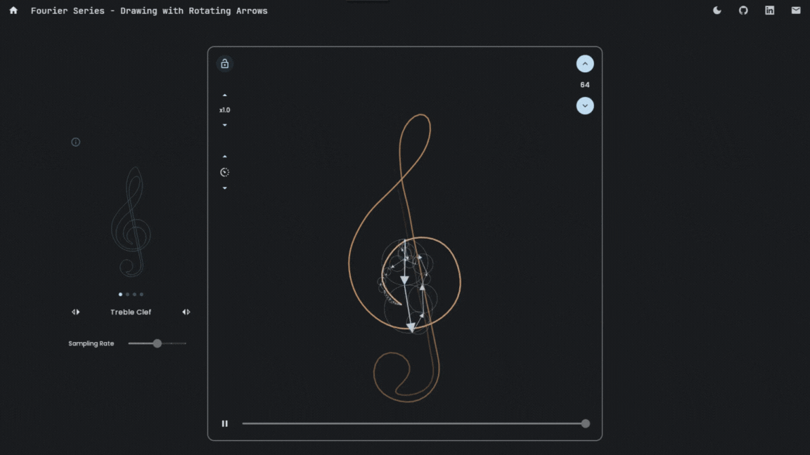

# kabob: web blog posts built with Kotlin/WASM + Compose for Web

[Try it yourself](https://ndming.github.io/visualizations/fs)

This repository explores the potential of web app development with the current state of Kotlin/WASM and Compose Multiplatform. 
The framework is fitted for building interactive web-based blog posts and visualization articles.
